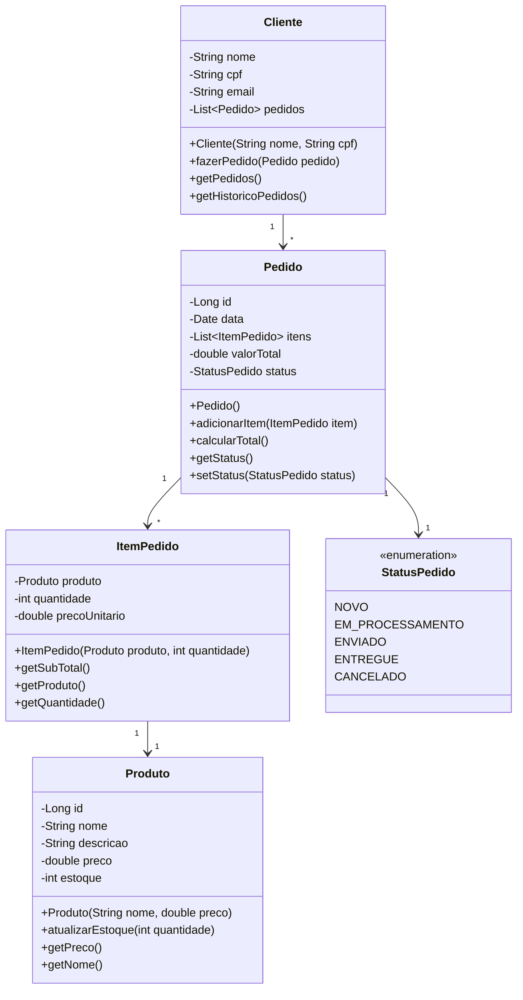

```mermaid
classDiagram
    class Cliente {
        -String nome
        -String cpf
        -String email
        -List~Pedido~ pedidos
        +Cliente(String nome, String cpf)
        +fazerPedido(Pedido pedido)
        +getPedidos()
        +getHistoricoPedidos()
    }

    class Pedido {
        -Long id
        -Date data
        -List~ItemPedido~ itens
        -double valorTotal
        -StatusPedido status
        +Pedido()
        +adicionarItem(ItemPedido item)
        +calcularTotal()
        +getStatus()
        +setStatus(StatusPedido status)
    }

    class ItemPedido {
        -Produto produto
        -int quantidade
        -double precoUnitario
        +ItemPedido(Produto produto, int quantidade)
        +getSubTotal()
        +getProduto()
        +getQuantidade()
    }

    class Produto {
        -Long id
        -String nome
        -String descricao
        -double preco
        -int estoque
        +Produto(String nome, double preco)
        +atualizarEstoque(int quantidade)
        +getPreco()
        +getNome()
    }

    class StatusPedido {
        <<enumeration>>
        NOVO
        EM_PROCESSAMENTO
        ENVIADO
        ENTREGUE
        CANCELADO
    }

    Cliente "1" --> "*" Pedido
    Pedido "1" --> "*" ItemPedido
    ItemPedido "1" --> "1" Produto
    Pedido "1" --> "1" StatusPedido
```